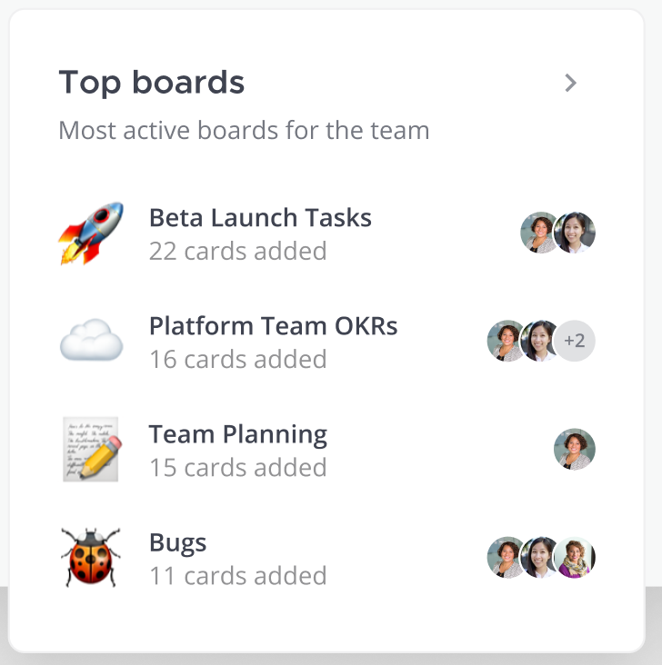
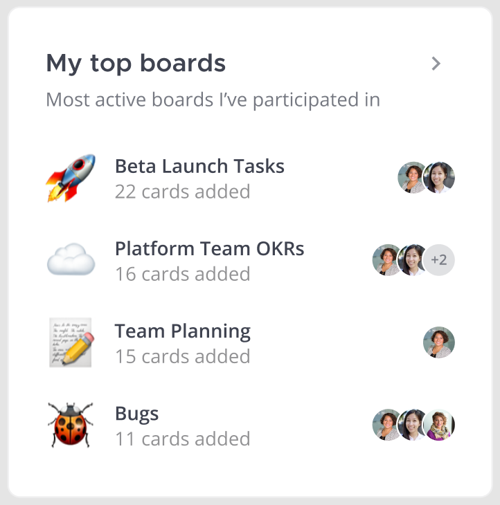
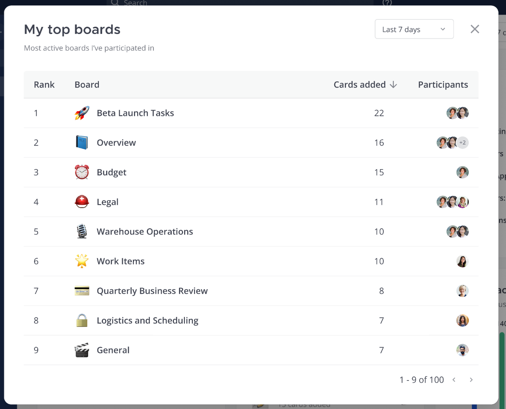

# Tech Spec: Top Boards, My Top Boards

## Screenshots

## Components 

1. Board icon or default dartboard icon
1. Board name or `(Untitled Board)`
1. Count of cards added (tbd: new copy for "22 cards added")
    * `card` created or edited
    * `comment` created or edited
    * `text` created or edited
1. Avatars of participants
    * a "participant" is anyone who is "active" in the given period 
    * "active" means they were the `modified_by` or `created_by` user of a `card`, `comment`, or `text`
    * include the `creator_by` user in the participants list even if they were not active
1. My boards
    * A board is "mine" if I was active during the given period