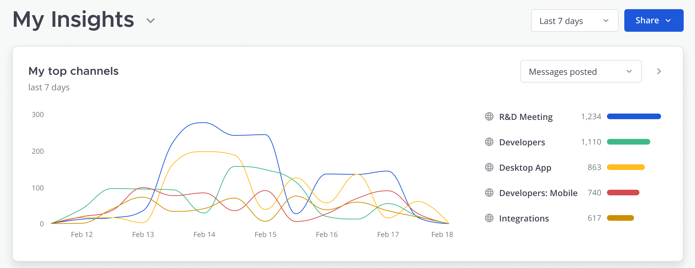

# Tech Spec: Top Channels Widget



## Outline
Most active channels by number of posts in given time period.

- Bot messages are not counted

## Performance and Scalability
Some of these queries could be expensive if you have large channel and post tables. Making GET requests on each widget could be slow if we are running these queries every GET request.

One approach could be to set up a job that runs every X minutes that fetches top 5 channels and top 5 posts/threads per team and using websockets we just push the results up to the frontend. The job could also just cache the results for everyone so they can fetch as normal with a GET request.

- Posts might needs indexes on type

## Websockets

## Rest APIs

New endpoint to fetch top 5 channels for team, this seems to be the URI layout for fetching channels in a team.

GET /api/v4/channels/top?page=0&per_page=5&since=<timestamp>&team_id=123
```
[
	{
		Id: 'channelId',
		...otherChannelInfo,
		score: 180,
	},
	...
]
```

This one is for my top 5 channels, it's similar to an existing endpoint of fetching my channels in a team.

GET /api/v4/users/me/teams/ax96ny1bspdfted1tsdpecc9xc/channels/top?page=0&per_page=5&since=<timestamp>

```
[
	{
		Id: 'channelId',
		...otherChannelInfo,
		score: 180,
	},
	...
]
```

## Plugins

## Algorithm

### Query exploration
There is a column in the channel table that contains the total message count but unfortunately it includes bot messages.

#### Top 5 channels in a team
This query will filter all public channels in a team along with private channels that a user is a member of. It will exclude system messages and bot messages in order to get a true count of user messages.
```
SELECT p.channelid, count(p.id) AS post_count 
FROM posts p 
LEFT JOIN channels c on p.channelid = c.id
LEFT JOIN channelmembers cm on p.channelid = cm.channelid and cm.userid = 'dck4rimf8tr1fm8uuddc3ojgkw'
WHERE p.deleteat = 0 
AND p.createat > 1646571442991 
AND p.type = ''
AND (p.props->>'from_bot' IS NULL OR p.props->>'from_bot' = 'false')
AND c.deleteat = 0
AND c.teamid = 'ax96ny1bspdfted1tsdpecc9xc'
AND (c.type = 'O' OR (c.type = 'P' AND (cm.userid = 'dck4rimf8tr1fm8uuddc3ojgkw')))
Group By p.channelid
ORDER BY post_count DESC
LIMIT 5
```

#### Top 5 of my channels in a team
This query will filter public and private channels that I am a member of in a particular team. It will exclude system messages and bot messages in order to get a true count of user messages.
```
SELECT p.channelid, count(p.id) AS post_count 
FROM posts p 
LEFT JOIN channels c on p.channelid = c.id
LEFT JOIN channelmembers cm on p.channelid = cm.channelid and cm.userid = 'dck4rimf8tr1fm8uuddc3ojgkw'
WHERE p.deleteat = 0 
AND p.createat > 1646571442991 
AND p.type = ''
AND (p.props->>'from_bot' IS NULL OR p.props->>'from_bot' = 'false')
AND c.deleteat = 0
AND c.teamid = 'ax96ny1bspdfted1tsdpecc9xc'
AND ((c.type = 'O' AND (cm.userid = 'dck4rimf8tr1fm8uuddc3ojgkw')) OR (c.type = 'P' AND (cm.userid = 'dck4rimf8tr1fm8uuddc3ojgkw')))
Group By p.channelid
ORDER BY post_count DESC
LIMIT 5
```
**The below queries are not needed for MVP**

Top 5 Channels by posts and reactions combined:
```
SELECT p.channelid, count(r.postid) + count(p.id) AS total
FROM posts p 
LEFT JOIN reactions r ON p.id = r.postid
WHERE (r.deleteat = 0 AND r.createat > 1646861127000) 
OR (p.deleteat = 0 AND p.createat > 1646861127000)
AND p.type = ''
Group By p.channelid
ORDER BY total DESC
LIMIT 5;
```

Top 5 channels by reaction count:
```
SELECT p.channelid, count(r.postid) AS reaction_count 
FROM posts p 
LEFT JOIN reactions r ON p.id = r.postid
WHERE r.deleteat = 0 
AND r.createat > 1646571442991 
AND p.type = ''
Group By p.channelid
ORDER BY reaction_count DESC
LIMIT 5;
```

## Temporal
- Last 24 hours
- Last 7 days
- 28 days?

## Scope
1. Top 5 channels per team, this includes all public channels and private channels I'm a member of.
2. My top 5 channels (channels I’m a member of) per team.

## Authorization
Does each individual widget require a permission?

## Guest Visibility
This is up for debate, guests are only granted access to certain channels so should they be able to see the other channels in the list?

## Licensing
I’m guessing the overarching feature of insights will have a license and each widget will be the same license type?

## Configs/feature flags
This widget will need it’s own config to enable/disable it

## Common Components
For the line chart we can reuse the existing LineChart component with some changes. 

We could reuse the the card component but would need to change some styles.