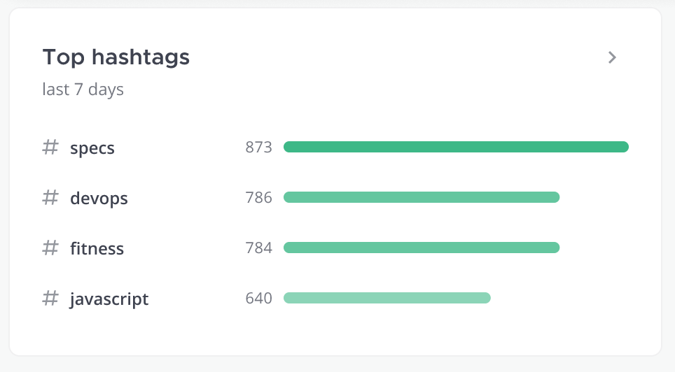

# Tech Spec: Top Hashtags Widget




```sql
-- top team hashtags (postgres)
-- this does not scale well if there are a lot of posts with hashtags
-- it seems to be fine with lots of posts
select
    (unnest(STRING_TO_ARRAY(hashtags, ' '))) as hashtag,
    count(*) occurences
from
    posts
    join channels on channels.id = posts.channelid
    join teams on teams.id = channels.teamid
where
    hashtags != ''
    AND teams.id = 'fyywt58zhtf98e4x4o6s4igrho'
    and channels.type = 'O'
    and posts.createat > 1612900807311
group by
    hashtag
order by
    occurences desc
limit
    5;
```
```shell
+----------+------------+
| hashtag  | occurences |
|----------+------------|
| #foo     | 4          |
| #bar     | 1          |
+----------+------------+
```