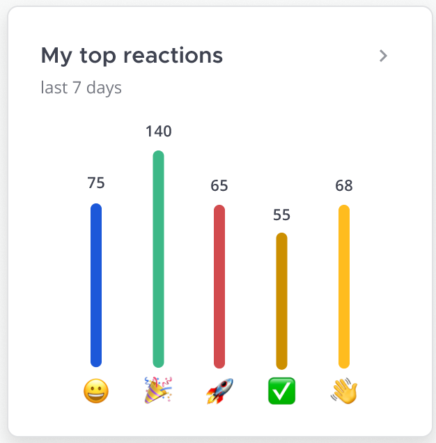

# Tech Spec: Top Reactions Widget



## Outline
This component shows the top reactions for a given team or user.

## Performance and Scalability
This will have the same performance concerns as top channels and top posts/threads where it may be beneficial to cache the data and only fetch new data every X minutes.

There are concerns regarding query performance when we do fetch the data for a team. Reactions are team agnostic, so we will need to reference a reaction's parent post and channel to then filter by team.
- Reactions will need an index on `createat`.

## Websockets

## Rest APIs
New endpoint to get top reactions (for a given team and user).

#### Parameters:
- `time_range`:
    - `1_day`
    - `7_day`
    - `30_day`
- `page`
- `per_page`

### Team
```
GET /api/v4/reactions/top/team/<team_id>?time_range=1_day&page=0&per_page=5
```
```json
[
	{
        "emoji_name": "smile",
        "count": 100,
	},
]
```

### User
```
GET /api/v4/reactions/top/user/<user_id>?time_range=1_day&page=0&per_page=5
```
```json
[
	{
        "emoji_name": "smile",
        "count": 100,
	},
]
```

- `emoji_name` is a `string` that contains the name of the emoji.
- `count` is an `int64` and represents the number of times that emoji was used.

## Plugins


## Algorithm

### Queries
```sql
-- Top 5 Reactions for a Team
SELECT
	emojiname,
	count(emojiname) AS emoji_count
FROM
	reactions r
	INNER JOIN posts p ON r.postid = p.id
	INNER JOIN channels c ON p.channelid = c.id
	INNER JOIN teams t ON c.teamid = t.id
WHERE
	r.deleteat = 0
	AND t.id = 'team123'
	AND r.createat > 1646923727584
GROUP BY
	r.emojiname
ORDER BY
	emoji_count DESC
LIMIT 5
OFFSET 0
```

```sql
-- Top 5 Reactions for a User (Across entire workspace)
SELECT
	emojiname,
	count(emojiname) AS emoji_count
FROM
	reactions r
	INNER JOIN posts p ON r.postid = p.id
 	INNER JOIN channels c ON p.channelid = c.id
WHERE
	r.deleteat = 0
	AND r.userid = '1ztefh3wxjft5cr4h8c9xzq73y'
	AND r.createat > 0
GROUP BY
	r.emojiname
ORDER BY
	emoji_count DESC
LIMIT 5
```

```sql
-- Top 5 Reactions for a User (Scoped to a team excluding DMs/GMs)
SELECT
	emojiname,
	count(emojiname) AS emoji_count
FROM
	reactions r
	INNER JOIN posts p ON r.postid = p.id
 	INNER JOIN channels c ON p.channelid = c.id
WHERE
	r.deleteat = 0
	AND c.teamid = '1r4g1enno7nb3exz3t6s5fdmsw'
	AND r.userid = '1ztefh3wxjft5cr4h8c9xzq73y'
	AND r.createat > 0
GROUP BY
	r.emojiname
ORDER BY
	emoji_count DESC
LIMIT 5
```

```sql
-- Top 5 Reactions for a User (Scoped to a team including DMs/GMs)
SELECT DISTINCT
		emojiname,
		SUM(emoji_count) OVER (PARTITION BY emojiname) AS emoji_total 
	FROM
		((  SELECT
				emojiname,
				count(emojiname) as emoji_count
			FROM
				reactions r
				INNER JOIN posts p ON r.postid = p.id
				INNER JOIN channels c ON p.channelid = c.id
			WHERE
				r.deleteat = 0
				AND c.teamid = '1r4g1enno7nb3exz3t6s5fdmsw'
				AND r.userid = 'zzfn3e81etf4mbyekg8gkgczre'
				AND r.createat > 0
			GROUP BY
				r.emojiname
		) UNION ALL (
			SELECT
				emojiname,
				count(emojiname) as emoji_count
			FROM
				reactions r
				INNER JOIN posts p ON r.postid = p.id
				INNER JOIN channels c ON p.channelid = c.id
			WHERE
				r.deleteat = 0
				AND r.userid = 'zzfn3e81etf4mbyekg8gkgczre'
				AND(c.type = 'D'
					OR c.type = 'G')
				AND r.createat > 0
			GROUP BY
				r.emojiname
		)) AS TOP_EMOJIS
ORDER BY
	emoji_total DESC
LIMIT 5
```


## Design Patterns That Could be Used

## Database Schema Changes


## Temporal
- Last 24 hours
- Last 7 days
- Last 28 days

## Scope
- Top reactions across the team (including public/private channels)
- Top reactions for the current user (within the team)

## Authorization
- Does each individual widget require a permission?
- Should have same authorization requirements as top posts/threads

## Guest Visibility
This is up for debate, guests are only granted access to certain channels so should they be able to see reaction info for other channels? The reaction information that is exposed via this widget is minimal so it's up for discussion if it's worth filtering the data further for guest accounts.

## Licensing
- Match overall feature license

## Configs/Feature Flags
This widget will need it’s own config to enable/disable it.

## Common Components
- The widget (and its inner elements) will be common components shared across the insights component.
- The bar graph used for the top 5 reactions is shared with the top channels bar graph.

## Security Review

## Telemetry
