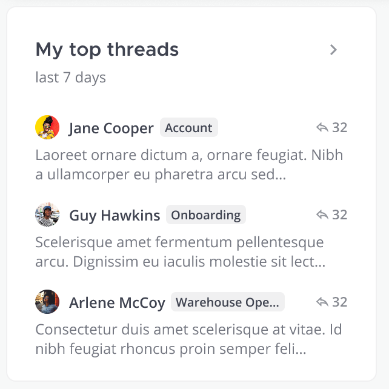

# Tech Spec: Top Threads Widget



## Outline
This will outline the top 5 posts based on number of replies. 

## Performance and Scalability

## Websockets

## Rest APIs
New endpoint to fetch top 5 posts
GET /api/v4/posts/top?page=0&per_page=5&since=<timestamp>&team_id=123
```
[
	{
		Id: 'postId',
		...otherpostInfo,
		engagement: 180,
	},
	...
]
```

## Plugins

## Algorithm

#### Team view
Top threads in all public channels and private channels I am a member of. This stays the same regardless of CRT and auto-follow configs.

```sql
(
    SELECT
        t.postid,
        t.replycount,
        t.channelid,
        c.displayname
    FROM
        threads t
        LEFT JOIN PublicChannels c ON t.channelid = c.id
    WHERE
        t.lastreplyat > 1648239422000
        AND c.teamid = 'hxxc8obejfd1fcyw5ng9kw7hxc'
    GROUP BY
        t.postid,
        c.displayname
    ORDER BY
        t.replycount DESC
    LIMIT
        10
)
UNION
ALL (
    SELECT
        t.postid,
        t.replycount,
        t.channelid,
        c.displayname
    FROM
        channelmembers cm
        LEFT JOIN threads t ON t.channelid = cm.channelid
        LEFT JOIN channels c ON t.channelid = c.id
    WHERE
        cm.userid = '4acxdugfriyyp8ax34dtj11b7e'
        AND c.type = 'P'
        AND c.teamid = 'hxxc8obejfd1fcyw5ng9kw7hxc'
        AND t.lastreplyat > 1648239422000
    GROUP BY
        t.postid,
        c.displayname
    ORDER BY
        t.replycount DESC
    LIMIT
        10
);
```

#### My top threads 
Threads I follow in public, private, groups and DMs

<!-- ### CRT disabled and auto follow config enabled:
Team view top threads: Top threads in all public channels, private channels I am a member of, group messages and DMs
My top threads: Threads I follow in public, private, groups and DMs. Since auto follow is enabled, this will be threads a user starts, participates in, or is mentioned in are automatically followed

### CRT disabled and auto follow config disabled: -->


## Temporal
- Last 24 hours
- Last 7 days
- 28 days?

## Scope
- Scope by team
    - Show posts for all public channels and private channels I am a member of
    - Show posts for public channels and private that I am a member of

## Authorization
Does each individual widget require a permission?

## Guest Visibility
Guests won't have access to activity and insights.

## Licensing
I’m guessing the overarching feature of insights will have a license and each widget will be the same license type?

## Configs/feature flags
This widget will need it’s own config to enable/disable it
